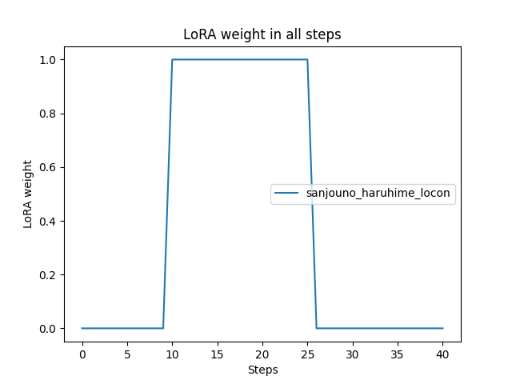
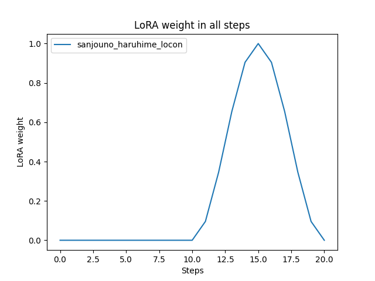

[](https://www.python.org/downloads/)
# Composable LoRA/LyCORIS with steps
この拡張機能は、内部のforward LoRAプロセスを置き換え、同時にLoCon、LyCORISをサポートします。

この拡張機能はComposable LoRAのフォークです。

[](https://www.youtube.com/watch?v=QS9yjSMySuY "stable-diffusion-webui-composable-lycoris")

### 言語
* [英語](README.md) (グーグル翻訳)
* [台湾中国語](README.zh-tw.md)  
* [簡体字中国語](README.zh-cn.md) (ウィキペディア 従来および簡略化された変換システム)

## インストール
注意: このバージョンのComposable LoRAには、元のComposable LoRAのすべての機能が含まれています。1つ選んでインストールするだけです。

この拡張機能は、元のバージョンのComposable LoRA拡張機能と同時に使用できません。インストールする前に、`webui\extensions\`フォルダー内の`stable-diffusion-webui-composable-lora`フォルダーを削除する必要があります。

次に、WebUIの\[Extensions\] -> \[Install from URL\]で以下のURLを入力します。
```
https://github.com/a2569875/stable-diffusion-webui-composable-lora.git
```
インストールして再起動します。

## デモ
ここでは2つのLoRA（1つはLoHA、もう1つはLoCon）を紹介します。 
* [`<lora:roukin8_loha:0.8>`](https://civitai.com/models/17336/roukin8-character-lohaloconfullckpt-8) に対応するトリガーワード： `yamanomitsuha`
* `<lora:dia_viekone_locon:0.7>` に対応するトリガーワード： `dia_viekone_\(ansatsu_kizoku\)`

[Latent Couple extension](https://github.com/opparco/stable-diffusion-webui-two-shot)と組み合わせます。

以下はその効果です。


以下のことが分かります。
- `<lora:roukin8_loha:0.8>`を`yamanomitsuha`と組み合わせ、そして`<lora:dia_viekone_locon:0.7>`を`dia_viekone_\(ansatsu_kizoku\)`と組み合わせることで、対応するキャラクターを描画できます。
- モデルのトリガーワードが互いに交換され、一致しなくなった場合、2つのキャラクターは描画できません。これは`<lora:roukin8_loha:0.8>`が画像の左側のブロックにのみ制限されているため、そして`<lora:dia_viekone_locon:0.7>`が画像の右側のブロックにのみ制限されているためです。したがって、このアルゴリズムは有効です。

画像のヒントの文法には[sd-webui-prompt-highlight](https://github.com/a2569875/sd-webui-prompt-highlight)プラグインが使用されています。

このテストは2023年5月14日に行われ、使用されたStable Diffusion WebUIのバージョンは[v1.2 (89f9faa)](https://github.com/AUTOMATIC1111/stable-diffusion-webui/commit/89f9faa63388756314e8a1d96cf86bf5e0663045)です。

(Note: You should enable \[`Lora: use old method that takes longer when you have multiple Loras active and produces same results as kohya-ss/sd-webui-additional-networks extension`\] in setting page.)

## 機能
### Composable-Diffusionと互換性がある
LoRAの挿入箇所を`AND`構文と関連付け、LoRAの影響範囲を特定のサブプロンプト内に限定します（特定の`AND...AND`ブロック内）。

### ステップに基づく可組合性
形式`[A:B:N]`のプロンプトにLoRAを配置し、LoRAの影響範囲を特定のグラフィックステップに制限します。


### LoRA重み制御
`[A #xxx]`構文を追加して、LoRAの各グラフィックステップでの重みを制御できます。
現在、サポートされているものは以下のとおりです。
* `decrease`
     - LoRAの有効なステップ数で徐々に重みを減少させ、0になります
* `increment`
     - LoRAの有効なステップ数で0から重みを徐々に増加させます
* `cmd(...)`
     - カスタムの重み制御コマンドで、主にPython構文を使用します。
         * 使用可能なパラメータ
             + `weight`
                 * 現在のLoRA重み
             + `life`
                 * 0-1の数字で、現在のLoRAのライフサイクルを表します。開始ステップ数にある場合は0であり、このLoRAが最後に適用されるステップ数にある場合は1です。
             + `step`
                 * 現在のステップ数
             + `steps`
                 * 全ステップ数
             + `lora`
                 * 現在のLoRAオブジェクト
             + `lora_module`
                 * 現在のLoRA作用層オブジェクト
             + `lora_type`
                 * 現在のLoRAのロードされた種類で、`lora`または`lyco`のいずれかです。
             + `lora_name`
                 * 現在のLoRAの名前
             + `lora_count`
                 * すべてのLoRAの数
             + `block_lora_count`
                 * 作用中の`AND...AND`ブロック内のLoRAの数
             + `is_negative`
                 * 反転提示語であるかどうか
             + `layer_name`
                 * 現在の作用層の名前。これを使用して、[LoRA Block Weight](https://github.com/hako-mikan/sd-webui-lora-block-weight)の効果をシミュレートできます。
             + `current_prompt`
                 * 作用中の`AND...AND`ブロック内のプロンプト
             + `sd_processing`
                 * sd画像の生成パラメータ
             + `enable_prepare_step`
                 * (出力用パラメータ) Trueに設定すると、この重みがtransformer text model encoder層に適用されます。 step == -1の場合は、現在transformer text model encoder層にいます。
         * 使用可能な関数は以下の通りです
             + `warmup(x)`
                 * xは0から1までの数値で、総ステップ数に対して、xの比率以下のステップでは関数値が0から1に徐々に上昇し、x以降は1になります。
             + `cooldown(x)`
                 * xは0から1までの数値で、総ステップ数に対して、xの比率以上のステップでは関数値が1から0に徐々に減少し、0になります。
             + sin, cos, tan, asin, acos, atan
                 * すべてのステップを周期とする三角関数です。sin、cosの値は0から1に変更されます。
             + sinr, cosr, tanr, asinr, acosr, atanr
                 * 弧度単位の周期2*piの三角関数です。
             + abs, ceil, floor, trunc, fmod, gcd, lcm, perm, comb, gamma, sqrt, cbrt, exp, pow, log, log2, log10
                 * Pythonのmath関数ライブラリと同じ関数です。
例 :
* `[<lora:A:1>::10]`
     - 名前がAのLoRAを使用して、10ステップで停止します。
       
* `[<lora:A:1>:<lora:B:1>:10]`
     - 名前がAのLoRAを、10ステップまで使用し、10ステップから名前がBのLoRAを使用します。
       
* `[<lora:A:1>:10]`
     - 10ステップから名前がAのLoRAを使用します。
* `[<lora:A:1>:0.5]`
     - 50％のステップから名前がAのLoRAを使用します。
* `[[<lora:A:1>::25]:10]`
     - 10ステップから名前がAのLoRAを使用し、25ステップで使用を停止します。
       
* `[<lora:A:1> #increment:10]`
     - 名前がAのLoRAを使用する期間中に重みを0から線形に増加させ、設定された重みに到達します。そして、10ステップからこのLoRAを使用します。
       
* `[<lora:A:1> #decrease:10]`
     - 名前がAのLoRAを使用する期間中に重みを1から線形に減少させ、0に到達します。そして、10ステップからこのLoRAを使用します。
       
* `[<lora:A:1> #cmd\(warmup\(0.5\)\):10]`
     - 名前がAのLoRAを使用する期間中、重みはウォームアップ定数であり、0からこのLoRAのライフサイクルの50％に到達するまで線形に増加します。そして、10ステップからこのLoRAを使用します。
     - 
* `[<lora:A:1> #cmd\(sin\(life\)\):20]`
     - 名前がAのLoRAを使用する期間中、重みは正弦波であり、10ステップからこのLoRAを使用します。
       

すべての生成された画像:


### 反向トークンに対する影響の消去
内蔵のLoRAを使用する場合、反転トークンは常にLoRAの影響を受けます。これは通常、出力に負の影響を与えます。この拡張機能は、負の影響を排除するオプションを提供します。

## 使用方法
### 有効化 (Enabled)
このオプションをオンにすると、Composable LoRAの機能を使用できるようになります。

### Composable LoRA with step
特定のステップでLoRAを有効または無効にする機能を使用するには、このオプションを選択する必要があります。

### Use Lora in uc text model encoder
言語モデルエンコーダー（text model encoder）の逆提示語部分でLoRAを使用します。
このオプションをオフにすると、より良い出力が期待できます。

### Use Lora in uc diffusion model
拡散モデル（diffusion model）またはデノイザー（denoiser）の逆提示語部分でLoRAを使用します。
このオプションをオフにすると、より良い出力が期待できます。

### plot the LoRA weight in all steps
\[Composable LoRA with step\]が選択されている場合、LoRAの重みが各ステップでどのように変化するかを観察するために、このオプションを選択できます。

## 互換性
`--always-batch-cond-uncond`は`--medvram`または`--lowvram`と一緒に使用する必要があります。

## 更新ログ
### 2023-04-02
* LoCon、LyCORISサポートを追加
* 不具合を修正：IndexError: list index out of range
### 2023-04-08
* 複数の異なるANDブロックで同じLoRAを使用できるようにする
  
### 2023-04-13
* 2023-04-08のバージョンでpull requestを提出
### 2023-04-19
* pytorch 2.0を使用する場合に拡張がロードされない問題を修正
* 不具合を修正: RuntimeError: Expected all tensors to be on the same device, but found at least two devices, cuda and cpu! (when checking argument for argument mat2 in method wrapper_CUDA_mm)
### 2023-04-20
* 特定のステップでLoRAを有効または無効にする機能を実装
* LoCon、LyCORISの拡張プログラムを参考にし、異なるANDブロックおよびステップでのLoRAの有効化/無効化アルゴリズムを改善
### 2023-04-21
* 異なるステップ数でのLoRAの重みを制御する方法の実装 `[A #xxx]`
* 異なるステップ数でのLoRAの重み変化を示すグラフの作成
### 2023-04-22
* 不具合を修正: AttributeError: 'Options' object has no attribute 'lora_apply_to_outputs'
* 不具合を修正: RuntimeError: "addmm_impl_cpu_" not implemented for 'Half'

## 特別な感謝
*  [opparco: Composable LoRAの元の作者である](https://github.com/opparco)、[Composable LoRA](https://github.com/opparco/stable-diffusion-webui-composable-lora)
*  [JackEllieのStable-Siffusionコミュニティチーム](https://discord.gg/TM5d89YNwA) 、 [YouTubeチャンネル](https://www.youtube.com/@JackEllie)
*  [中文ウィキペディアのコミュニティチーム](https://discord.gg/77n7vnu)

<p align="center"></p>