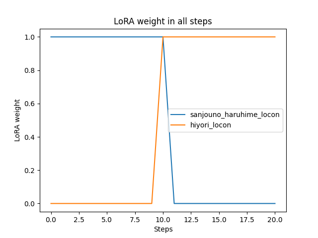

# Composable LoRA/LyCORIS with steps
这个扩展取代了内置的 forward LoRA 过程，同时提供对LoCon、LyCORIS的支持

本扩展Fork自Composable LoRA扩展

### 语言
* [繁体中文](README.zh-tw.md)  
* [英语](README.md) (google translate)
* [日语](README.ja.md) (ChatGPT)

## 安装
注意 : 这个版本的Composable LoRA已经包含了原版Composable LoRA的所有功能，只要选一个安装就好。

此扩展不能与原始版本的Composable LoRA扩展同时使用，安装前必须先删除原始版本的Composable LoRA扩展。请先到`webui\extensions\`文件夹下删除`stable-diffusion-webui-composable-lora`文件夹

接下来到webui的\[扩展\] -> \[从网址安装\]输入以下网址:
```
https://github.com/a2569875/stable-diffusion-webui-composable-lora.git
```
安装并重启即可

## 功能
### 与 Composable-Diffusion 兼容
将 LoRA 在提示词中的插入位置与`AND`语法相关系，让 LoRA 的影响范围限制在特定的子提示词中 (特定 AND...AND区块中)。

### 在步骤数上的 Composable
使 LoRA 支持放置在形如`[A:B:N]`的提示词语法中，让 LoRA 的影响范围限制在特定的绘图步骤上。


### LoRA 权重控制
添加了一个语法`[A #xxx]`可以用来控制LoRA在每个绘图步骤的权重
目前支持的有:
* `decrease`
     - 在LoRA的有效步骤数内逐渐递减权重直到0
* `increment`
     - 在LoRA的有效步骤数内从0开始逐渐递增权重
* `cmd(...)`
     - 自定义的权重控制指令，主要以python语法为主
         * 可用参数
             + `weight`
                 * 当前的LoRA权重
             + `life`
                 * 0-1之间的数字，表示目前LoRA的生命周期。位于起始步骤数时为0，位于此LoRA最终作用的步骤数时为1
             + `step`
                 * 目前的步骤数
             + `steps`
                 * 总共的步骤数
         * 可用函数
             + `warmup(x)`
                 * x为0-1之间的数字，表示一个预热的常数，以总步数计算，在低于x比例的步数时，函数值从0逐渐递增，直到x之后为1
             + `cooldown(x)`
                 * x为0-1之间的数字，表示一个冷却的常数，以总步数计算，在高于x比例的步数时，函数值从1逐渐递减，直到0
             + sin, cos, tan, asin, acos, atan
                 * 以所有步数为周期的三角函数。其中sin, cos的值预被改成0到1之间
             + sinr, cosr, tanr, asinr, acosr, atanr
                 * 以弧度为单位的三角函数，周期 2*pi。
             + abs, ceil, floor, trunc, fmod, gcd, lcm, perm, comb, gamma, sqrt, cbrt, exp, pow, log, log2, log10
                 * 同python的math函数库中的函数
示例 :
* `[<lora:A:1>::10]`
     - 使用名为A的LoRA到第10步停止
       
* `[<lora:A:1>:<lora:B:1>:10]`
     - 使用名为A的LoRA到第10步为止，从第10步开始换用名为B的LoRA
       
* `[<lora:A:1>:10]`
     - 从第10步才开始使用名为A的LoRA
* `[<lora:A:1>:0.5]`
     - 从50%的步数才开始使用名为A的LoRA
* `[[<lora:A:1>::25]:10]`
     - 从第10步才开始使用名为A的LoRA，并且到第25步停止使用
       
* `[<lora:A:1> #increment:10]`
     - 在名为A的LoRA使用期间，权重从0开始线性递增直到设置的权重，且从第10步才开始使用此LoRA
       
* `[<lora:A:1> #decrease:10]`
     - 在名为A的LoRA使用期间，权重从1开始线性递减直到0，且从第10步才开始使用此LoRA
       
* `[<lora:A:1> #cmd\(warmup\(0.5\)\):10]`
     - 在名为A的LoRA使用期间，权重为预热的常数，从0开始递增直到50%的此LoRA生命周期达到设置的权重，且从第10步才开始使用此LoRA
     - 
* `[<lora:A:1> #cmd\(sin\(life\)\):20]`
     - 在名为A的LoRA使用期间，权重为正弦波，且从第10步才开始使用此LoRA
       

所有生成的图像 :


### 消除对反向提示词的影响
使用内置的 LoRA 时，反向提示词总是受到 LoRA 的影响。 这通常会对输出产生负面影响。
而此扩展程序提供了消除负面影响的选项。

## 使用方法
### 激活 (Enabled)
勾选此选项之后才能使用Composable LoRA的功能。

### Composable LoRA with step
勾选此选项之后才能使用在特定步数上激活或不激活LoRA的功能。

### 在反向提示词的语言模型编码器上使用LoRA (Use Lora in uc text model encoder)
在语言模型编码器(text model encoder)的反向提示词部分使用LoRA。
关闭此选项后，您可以期待更好的输出。

### 在反向提示词的扩散模型上上使用LoRA (Use Lora in uc diffusion model)
在扩散模型(diffusion model)或称降噪器(denoiser)的反向提示词部分使用LoRA。
关闭此选项后，您可以期待更好的输出。

### 绘制LoRA权重与步数关系的图表 (plot the LoRA weight in all steps)
如果有勾选\[Composable LoRA with step\]，可以勾选此选项来观察LoRA权重在每个步骤数上的变化

## 兼容性
`--always-batch-cond-uncond`必须与`--medvram`或`--lowvram`一起使用

## 更新日志
### 2023-04-02
* 新增LoCon、LyCORIS支持
* 修正: IndexError: list index out of range
### 2023-04-08
* 允许在多个不同AND区块使用同一个LoRA
  
### 2023-04-13
* 2023-04-08的版本提交pull request
### 2023-04-19
* 修正使用 pytorch 2.0 时，扩展加载失败的问题
* 修正: RuntimeError: Expected all tensors to be on the same device, but found at least two devices, cuda and cpu! (when checking argument for argument mat2 in method wrapper_CUDA_mm)
### 2023-04-20
* 实现控制LoRA在指定步数激活与不激活的功能
* 参考LoCon、LyCORIS扩展的代码，改善LoRA在不同AND区块与步数激活与不激活的算法
### 2023-04-21
* 实现控制LoRA在不同步骤数能有不同权重的方法`[A #xxx]`
* 绘制LoRA权重在不同步骤数之变化的图表

## 铭谢
*  [Composable LoRA原始作者opparco](https://github.com/opparco)、[Composable LoRA](https://github.com/opparco/stable-diffusion-webui-composable-lora)
*  [JackEllie的Stable-Siffusion的社群团队](https://discord.gg/TM5d89YNwA) 、 [Youtube频道](https://www.youtube.com/@JackEllie)
*  [中文维基百科的社群团队](https://discord.gg/77n7vnu)