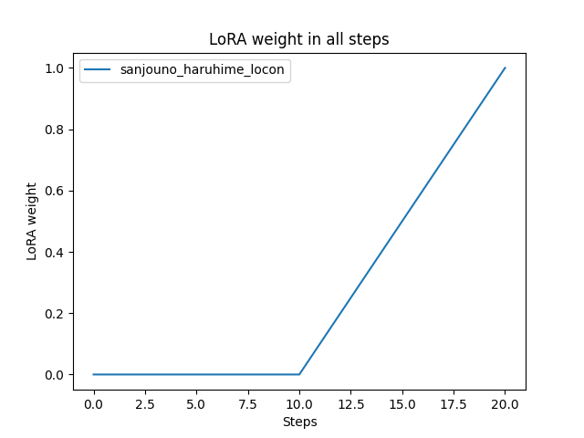
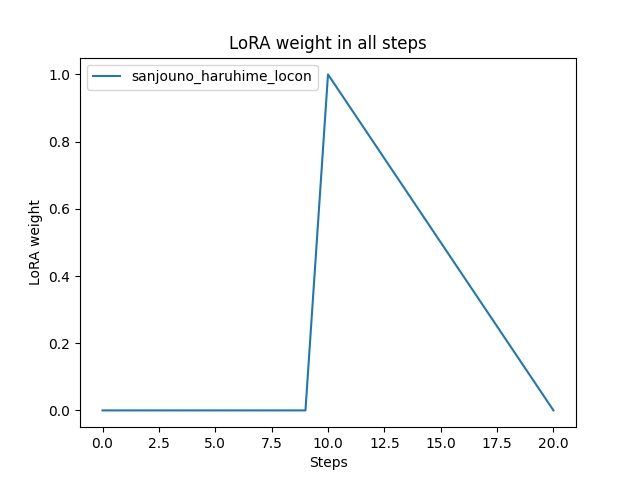
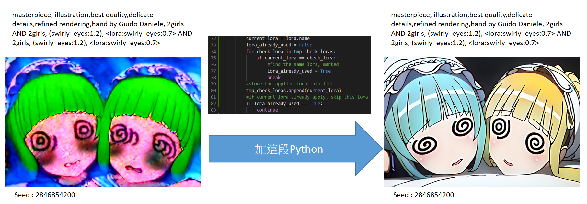

[](https://www.python.org/downloads/)
[](https://github.com/a2569875/stable-diffusion-webui-composable-lora/blob/main/LICENSE)
# Composable LoRA/LyCORIS with steps
這個擴展取代了內置的 forward LoRA 過程，同時提供對LoCon、LyCORIS的支援。

本擴展Fork自Composable LoRA擴展

[](https://www.buymeacoffee.com/a2569875 "buy me a coffee")

[](https://www.youtube.com/watch?v=QS9yjSMySuY "stable-diffusion-webui-composable-lycoris")

### 語言
* [英文](README.md) (google翻譯)
* [简体中文](README.zh-cn.md) (維基百科繁簡轉換系統)
* [日文](README.ja.md) (ChatGPT翻譯)

## 安裝
注意 : 這個版本的Composable LoRA已經包含了原版Composable LoRA的所有功能，只要選一個安裝就好。

此擴展不能與原始版本的Composable LoRA擴展同時使用，安裝前必須先刪除原始版本的Composable LoRA擴展。請先到`webui\extensions\`資料夾下刪除`stable-diffusion-webui-composable-lora`資料夾

接下來到webui的\[擴充功能\] -> \[從網址安裝\]輸入以下網址:
```
https://github.com/a2569875/stable-diffusion-webui-composable-lora.git
```
安裝並重新啟動即可

## 演示
這裡示範兩個LoRA (分別為LoHA和LoCon)，其中
* [`<lora:roukin8_loha:0.8>`](https://civitai.com/models/17336/roukin8-character-lohaloconfullckpt-8) 對應的觸發詞: `yamanomitsuha`
* `<lora:dia_viekone_locon:0.8>` 對應的觸發詞: `dia_viekone_\(ansatsu_kizoku\)`

並搭配[Latent Couple extension](https://github.com/opparco/stable-diffusion-webui-two-shot)

效果如下:

可以看到:
- 當我`<lora:roukin8_loha:0.8>`搭配`yamanomitsuha`，以及`<lora:dia_viekone_locon:0.8>`搭配`dia_viekone_\(ansatsu_kizoku\)`的組合可以順利畫出對應角色；
- 當模型觸發詞互相交換而導致不匹配時，兩個角色都無法順利畫出，可見`<lora:roukin8_loha:0.8>`被限制在只作用於圖片的左半邊區塊、而`<lora:dia_viekone_locon:0.8>`被限制在只作用於圖片的右半邊區塊，因此這個演算法是有效的。

圖片上的提示詞語法使用[sd-webui-prompt-highlight](https://github.com/a2569875/sd-webui-prompt-highlight)插件進行上色。

本次測試於2023年5月14日完成，使用Stable Diffusion WebUI版本為[v1.2 (89f9faa)](https://github.com/AUTOMATIC1111/stable-diffusion-webui/commit/89f9faa63388756314e8a1d96cf86bf5e0663045)


## 功能
### 與 Composable-Diffusion 相容
將 LoRA 在提示詞中的插入位置與`AND`語法相關聯，讓 LoRA 的影響範圍限制在特定的子提示詞中 (特定 AND...AND區塊中)。

### 在步驟數上的 Composable
使 LoRA 支援放置在形如`[A:B:N]`的提示詞語法中，讓 LoRA 的影響範圍限制在特定的繪圖步驟上。


### LoRA 權重控制
添加了一個語法`[A #xxx]`可以用來控制LoRA在每個繪圖步驟的權重

如果 `#` 不起作用，您可以將 `#` 符號替換為 `\u0023`。

目前支援的有:
* `decrease`
     - 在LoRA的有效步驟數內逐漸遞減權重直到0
* `increment`
     - 在LoRA的有效步驟數內從0開始逐漸遞增權重
* `cmd(...)`
     - 自定義的權重控制指令，主要以python語法為主
         * 可用參數
             + `weight`
                 * 當前的LoRA權重
             + `life`
                 * 0-1之間的數字，表示目前LoRA的生命週期。位於起始步驟數時為0，位於此LoRA最終作用的步驟數時為1
             + `step`
                 * 目前的步驟數
             + `steps`
                 * 總共的步驟數
             + `lora`
                 * 目前的LoRA物件
             + `lora_module`
                 * 目前的LoRA作用層物件
             + `lora_type`
                 * 目前的LoRA載入的種類，可能是`lora`或`lyco`
             + `lora_name`
                 * 目前的LoRA名稱
             + `lora_count`
                 * 所有LoRA的數量
             + `block_lora_count`
                 * 作用中的`AND...AND`區塊內LoRA的數量
             + `is_negative`
                 * 是否為反向提示詞
             + `layer_name`
                 * 目前作用層名稱。你可以用這來來判斷並模擬[LoRA Block Weight](https://github.com/hako-mikan/sd-webui-lora-block-weight)的效果
             + `current_prompt`
                 * 作用中的`AND...AND`區塊內的提示詞
             + `sd_processing`
                 * sd圖片生成的參數
             + `enable_prepare_step`
                 * (輸出用參數) 如果設為True，則代表此權重會做用到transformer text model encoder層。如過step==-1代表目前在transformer text model encoder層。
         * 可用函數
             + `warmup(x)`
                 * x為0-1之間的數字，表示一個預熱的常數，以總步數計算，在低於x比例的步數時，函數值從0逐漸遞增，直到x之後為1
             + `cooldown(x)`
                 * x為0-1之間的數字，表示一個冷卻的常數，以總步數計算，在高於x比例的步數時，函數值從1逐漸遞減，直到0
             + sin, cos, tan, asin, acos, atan
                 * 以所有步數為週期的三角函數。其中sin, cos的值預被改成0到1之間
             + sinr, cosr, tanr, asinr, acosr, atanr
                 * 以弧度為單位的三角函數，週期 2*pi。
             + abs, ceil, floor, trunc, fmod, gcd, lcm, perm, comb, gamma, sqrt, cbrt, exp, pow, log, log2, log10
                 * 同python的math函數庫中的函數
範例 :
* `[<lora:A:1>::10]`
     - 使用名為A的LoRA到第10步停止
       
* `[<lora:A:1>:<lora:B:1>:10]`
     - 使用名為A的LoRA到第10步為止，從第10步開始換用名為B的LoRA
       
* `[<lora:A:1>:10]`
     - 從第10步才開始使用名為A的LoRA
* `[<lora:A:1>:0.5]`
     - 從50%的步數才開始使用名為A的LoRA
* `[[<lora:A:1>::25]:10]`
     - 從第10步才開始使用名為A的LoRA，並且到第25步停止使用
       
* `[<lora:A:1> #increment:10]`
     - 在名為A的LoRA使用期間，權重從0開始線性遞增直到設定的權重，且從第10步才開始使用此LoRA
       
* `[<lora:A:1> #decrease:10]`
     - 在名為A的LoRA使用期間，權重從1開始線性遞減直到0，且從第10步才開始使用此LoRA
       
* `[<lora:A:1> #cmd\(warmup\(0.5\)\):10]`
     - 在名為A的LoRA使用期間，權重為預熱的常數，從0開始遞增直到50%的此LoRA生命週期達到設定的權重，且從第10步才開始使用此LoRA
     - 
* `[<lora:A:1> #cmd\(sin\(life\)\):20]`
     - 在名為A的LoRA使用期間，權重為正弦波，且從第10步才開始使用此LoRA
       
```python
[<lora:A:1> #cmd\(
def my_func\(\)\:
    return sin\(life\)
my_func\(\)
\):10]
```
- 與`[<lora:A:1> #cmd\(sin\(life\)\):10]`相同，但用了函數語法

所有生成的圖像 :


* 提示 :
   - 如果`[<lora:A:1> #cmd\(sin\(life\)\):10]`沒有作用的話，試試`[<lora:A:1> \u0023cmd\(sin\(life\)\):10]`。
   - 如果`[<lora:A:1> #increment:10]`沒有作用的話，試試`[<lora:A:1> \u0023increment:10]` 。

### 消除對反向提示詞的影響
使用內建的 LoRA 時，反向提示詞總是受到 LoRA 的影響。 這通常會對輸出產生負面影響。
而此擴展程序提供了消除負面影響的選項。

## 使用方法
### 啟用 (Enabled)
勾選此選項之後才能使用Composable LoRA的功能。

### Composable LoRA with step
勾選此選項之後才能使用在特定步數上啟用或不啟用LoRA的功能。

### 在反向提示詞的語言模型編碼器上使用LoRA (Use Lora in uc text model encoder)
在語言模型編碼器(text model encoder)的反向提示詞部分使用LoRA。
關閉此選項後，您可以期待更好的輸出。

### 在反向提示詞的擴散模型上上使用LoRA (Use Lora in uc diffusion model)
在擴散模型(diffusion model)或稱降噪器(denoiser)的反向提示詞部分使用LoRA。
關閉此選項後，您可以期待更好的輸出。

### 繪製LoRA權重與步數關聯的圖表 (plot the LoRA weight in all steps)
如果有勾選\[Composable LoRA with step\]，可以勾選此選項來觀察LoRA權重在每個步驟數上的變化

### 其他
* 如果你產生的圖片崩成這樣:
  
  可嘗試以下步驟解決:
  1. 先關閉Composable LoRA
  2. 從你的提示詞中暫時移除所有LoRA
  3. 隨便生成一張圖片
  4. 如果產生的圖片是正常的，再次開啟Composable LoRA
  5. 再把剛才移除的LoRA加回去提示詞中 (注意，要先開啟Composable LoRA再加入LoRA語法)
  6. 應該就能正常產生圖片了

## 相容性
`--always-batch-cond-uncond`必須與`--medvram`或`--lowvram`一起使用

## 更新日誌
### 2023-04-02
* 新增LoCon、LyCORIS支援
* 修正: IndexError: list index out of range
### 2023-04-08
* 允許在多個不同AND區塊使用同一個LoRA
  
### 2023-04-13
* 2023-04-08的版本提交pull request
### 2023-04-19
* 修正使用 pytorch 2.0 時，擴展載入失敗的問題
* 修正: RuntimeError: Expected all tensors to be on the same device, but found at least two devices, cuda and cpu! (when checking argument for argument mat2 in method wrapper_CUDA_mm)
### 2023-04-20
* 實作控制LoRA在指定步數啟用與不啟用的功能
* 參考LoCon、LyCORIS擴展的程式碼，改善LoRA在不同AND區塊與步數啟用與不啟用的演算法
### 2023-04-21
* 實作控制LoRA在不同步驟數能有不同權重的方法`[A #xxx]`
* 繪製LoRA權重在不同步驟數之變化的圖表
### 2023-04-22
* 修正: AttributeError: 'Options' object has no attribute 'lora_apply_to_outputs'
* 修正: RuntimeError: "addmm_impl_cpu_" not implemented for 'Half'
### 2023-04-23
* 修正有時候LoRA加上去後會無法移除的問題 (症狀 : 崩圖。)
### 2023-04-25
* 加入對`<lyco:MODEL>`語法的支援。

## 銘謝
*  [Composable LoRA原始作者opparco](https://github.com/opparco)、[Composable LoRA](https://github.com/opparco/stable-diffusion-webui-composable-lora)
*  [JackEllie的Stable-Siffusion的社群團隊](https://discord.gg/TM5d89YNwA) 、 [Youtube頻道](https://www.youtube.com/@JackEllie)
*  [中文維基百科的社群團隊](https://discord.gg/77n7vnu)

<p align="center"></p>